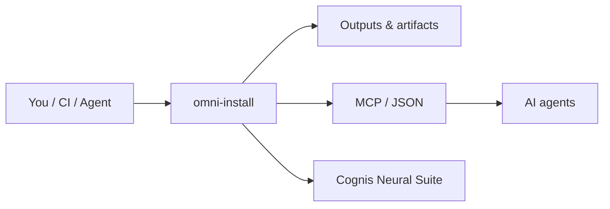

<div align="center">

# omni-install

### One menu to install every language, cloud CLI, container, and AI tool — on Linux, macOS, or Windows.

[](LICENSE)  [](https://github.com/cognis-digital/cognis-neural-suite)

</div>

<!-- cognis:layman:start -->
## What is this?

omni-install is a guided setup wizard that installs programming languages, developer tools, and AI software on your computer - no technical knowledge required. You run one command, answer a single question about how comfortable you are with the terminal, and then pick what you want from a numbered menu. It works on Linux, macOS, and Windows, and it never runs anything without showing you the exact command first so you know exactly what is happening. It is useful for anyone setting up a new development environment, from first-time programmers to experienced engineers who just want a fast, repeatable way to get their tools installed.
<!-- cognis:layman:end -->

<!-- cognis:domains:start -->
## Domains

**Primary domain:** Cloud & DevTools  ·  **JTF MERIDIAN division:** ATHENA-PRIME · COGNI-2

**Topics:** `cognis` `devtools` `cloud` `developer-tools` `cli`

Part of the **Cognis Neural Suite** — 300+ source-available tools organized across 12 domains under the JTF MERIDIAN command structure. See the [suite on GitHub](https://github.com/cognis-digital) and [jtf-meridian](https://github.com/cognis-digital/jtf-meridian) for how the pieces fit together.
<!-- cognis:domains:end -->

<!-- cognis:install:start -->
## Install

`omni-install` is source-available (not published to PyPI) — every method below installs
straight from GitHub. Pick whichever you prefer; the one-line scripts auto-detect
the best tool available on your machine.

**One-liner (Linux / macOS):**
```sh
curl -fsSL https://raw.githubusercontent.com/cognis-digital/omni-install/HEAD/install.sh | sh
```

**One-liner (Windows PowerShell):**
```powershell
irm https://raw.githubusercontent.com/cognis-digital/omni-install/HEAD/install.ps1 | iex
```

**Or install manually — any one of:**
```sh
pipx install "git+https://github.com/cognis-digital/omni-install.git"     # isolated (recommended)
uv tool install "git+https://github.com/cognis-digital/omni-install.git"  # uv
pip install "git+https://github.com/cognis-digital/omni-install.git"      # pip
```

**From source:**
```sh
git clone https://github.com/cognis-digital/omni-install.git
cd omni-install && pip install .
```

Then run:
```sh
python -m omni-install --help
```
<!-- cognis:install:end -->

## Quick start (guided)

New here? **Run one command and type a number.** The guided wizard adapts to how
familiar you are with the terminal (it asks once, on a scale of 1–5) and then
walks you through everything with plain-language explanations, showing the exact
command before it runs anything.

```bash
# Linux / macOS  — then just type a number
./setup.sh
```
```powershell
# Windows  — then just type a number
.\setup.ps1
```

That's it. The first prompt asks your comfort level; after that you get a
numbered menu:

```
╔══════════════════════════════════════════════════════════════╗
║ Cognis Setup Wizard 1.0    method=pipx · familiarity=1        ║
╚══════════════════════════════════════════════════════════════╝
  1 · Quick install (recommended starter bundle)
  2 · Browse by category
  3 · Pick individual tools
  4 · Install everything
  5 · Set up the local AI fleet (--ai mode)
  6 · Configure (install method, install dir)
  7 · Verify & health-check installed tools
  8 · Help / glossary
  9 · Change familiarity level
  0 · Exit

  Choose an option (0-9): 1
```

- **Safe preview** — see commands without running anything: `./setup.sh --dry-run`
- **Already have a CLI?** The same wizard is a subcommand: `python omni.py setup`
- **Custom catalog** — point it at any manifest (local path *or* raw URL):
  `./setup.sh --manifest https://raw.githubusercontent.com/cognis-digital/cognis-arsenal/master/MANIFEST.json`

With no local `MANIFEST.json`, the wizard automatically fetches the canonical
[cognis-arsenal](https://github.com/cognis-digital/cognis-arsenal) catalog. Offline,
it still offers local-AI-fleet setup, configuration, health-check, and help. It is
**stdlib-only** — nothing to `pip install` first.

---

## Package-manager menu (advanced)

Prefer the bare menu that just dispatches to your system package manager
(apt/dnf/pacman/brew/winget)? Pick what you want and it installs it:

```bash
# Linux / macOS
bash install.sh
# Python TUI (any OS)
python omni.py
```
```powershell
# Windows
powershell -ExecutionPolicy Bypass -File install.ps1
```

Edit **[catalog.yaml](catalog.yaml)** to add tools. Want a whole prebaked image instead? See
**[cognis-devbox](https://github.com/cognis-digital/cognis-devbox)**.

## How it fits



**Explore the suite →** [🗂️ all tools](https://github.com/cognis-digital/cognis-neural-suite) · [⭐ awesome-cognis](https://github.com/cognis-digital/awesome-cognis) · [🔗 cognis-sources](https://github.com/cognis-digital/cognis-sources)

<a name="verification"></a>
## Verification


Every push is verified end-to-end. Latest audit (2026-06-13):

```text
tests        : 0 passed, 0 failed, 0 errored
compile      : all modules parse
cli          : n/a
package      : n/a
```

<details><summary>CLI surface (<code>--help</code>)</summary>

```text
(see --help)
```
</details>

Full machine-readable results: [`AUDIT.md`](AUDIT.md) · regenerate with `python -m omni-install --help` + `pytest -q`.

<div align="right"><a href="#top">↑ back to top</a></div>


## License
COCL v1.0 — see [LICENSE](LICENSE).
