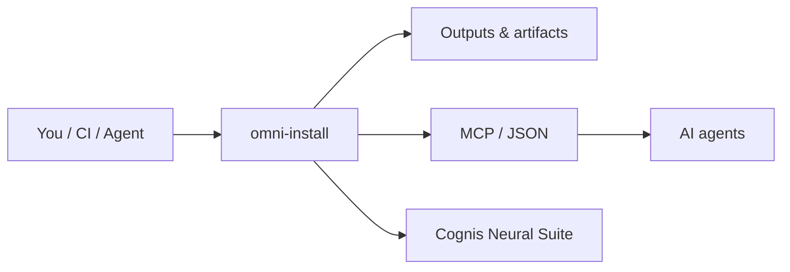

<div align="center">

# omni-install

### One menu to install every language, cloud CLI, container, and AI tool — on Linux, macOS, or Windows.

[](LICENSE)  [](https://github.com/cognis-digital/cognis-neural-suite)

</div>

Pick what you want from a menu; it dispatches to the right package manager (apt/dnf/pacman/brew/winget).

```bash
# Linux / macOS
bash install.sh
# Python TUI (any OS)
python omni.py
```
```powershell
# Windows
powershell -ExecutionPolicy Bypass -File install.ps1
```

Edit **[catalog.yaml](catalog.yaml)** to add tools. Want a whole prebaked image instead? See
**[cognis-devbox](https://github.com/cognis-digital/cognis-devbox)**.

## How it fits



**Explore the suite →** [🗂️ all tools](https://github.com/cognis-digital/cognis-neural-suite) · [⭐ awesome-cognis](https://github.com/cognis-digital/awesome-cognis) · [🔗 cognis-sources](https://github.com/cognis-digital/cognis-sources)

## License
COCL v1.0 — see [LICENSE](LICENSE).
