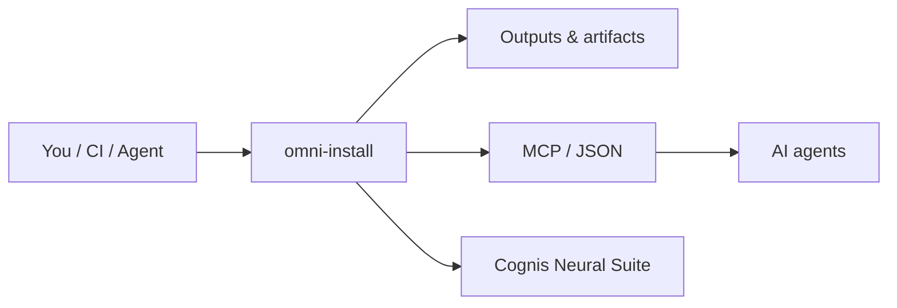

<div align="center">

# omni-install

### One menu to install every language, cloud CLI, container, and AI tool — on Linux, macOS, or Windows.

[](LICENSE)  [](https://github.com/cognis-digital/cognis-neural-suite)

</div>

## Usage — step by step

`omni-install` is a stdlib-only, cross-platform menu installer for languages, cloud CLIs, containers, and AI tools — plus a guided Cognis setup wizard.

1. **Install / first run** — fetch and launch (then just type a number):

   ```bash
   # Linux / macOS
   bash install.sh
   # Windows PowerShell:  .\install.ps1
   ```

2. **Open the package-manager menu** directly via the Python TUI (any OS):

   ```bash
   python omni.py
   ```

3. **Run the guided Cognis setup wizard** — the `setup` subcommand adapts to your familiarity level:

   ```bash
   python omni.py setup
   ```

4. **Preview before changing anything** — `setup` forwards extra flags to the wizard, e.g. a dry run:

   ```bash
   python omni.py setup --dry-run
   ```

5. **Use it in automation** — point the wizard at a manifest for repeatable, scripted provisioning:

   ```bash
   python omni.py setup --manifest https://raw.githubusercontent.com/cognis-digital/cognis-arsenal/master/MANIFEST.json
   ```

## Quick start (guided)

New here? **Run one command and type a number.** The guided wizard adapts to how
familiar you are with the terminal (it asks once, on a scale of 1–5) and then
walks you through everything with plain-language explanations, showing the exact
command before it runs anything.

```bash
# Linux / macOS  — then just type a number
./setup.sh
```
```powershell
# Windows  — then just type a number
.\setup.ps1
```

That's it. The first prompt asks your comfort level; after that you get a
numbered menu:

```
╔══════════════════════════════════════════════════════════════╗
║ Cognis Setup Wizard 1.0    method=pipx · familiarity=1        ║
╚══════════════════════════════════════════════════════════════╝
  1 · Quick install (recommended starter bundle)
  2 · Browse by category
  3 · Pick individual tools
  4 · Install everything
  5 · Set up the local AI fleet (--ai mode)
  6 · Configure (install method, install dir)
  7 · Verify & health-check installed tools
  8 · Help / glossary
  9 · Change familiarity level
  0 · Exit

  Choose an option (0-9): 1
```

- **Safe preview** — see commands without running anything: `./setup.sh --dry-run`
- **Already have a CLI?** The same wizard is a subcommand: `python omni.py setup`
- **Custom catalog** — point it at any manifest (local path *or* raw URL):
  `./setup.sh --manifest https://raw.githubusercontent.com/cognis-digital/cognis-arsenal/master/MANIFEST.json`

With no local `MANIFEST.json`, the wizard automatically fetches the canonical
[cognis-arsenal](https://github.com/cognis-digital/cognis-arsenal) catalog. Offline,
it still offers local-AI-fleet setup, configuration, health-check, and help. It is
**stdlib-only** — nothing to `pip install` first.

---

## Package-manager menu (advanced)

Prefer the bare menu that just dispatches to your system package manager
(apt/dnf/pacman/brew/winget)? Pick what you want and it installs it:

```bash
# Linux / macOS
bash install.sh
# Python TUI (any OS)
python omni.py
```
```powershell
# Windows
powershell -ExecutionPolicy Bypass -File install.ps1
```

Edit **[catalog.yaml](catalog.yaml)** to add tools. Want a whole prebaked image instead? See
**[cognis-devbox](https://github.com/cognis-digital/cognis-devbox)**.

## How it fits



**Explore the suite →** [🗂️ all tools](https://github.com/cognis-digital/cognis-neural-suite) · [⭐ awesome-cognis](https://github.com/cognis-digital/awesome-cognis) · [🔗 cognis-sources](https://github.com/cognis-digital/cognis-sources)

## Interoperability

`{}` composes with the 300+ tool Cognis suite — JSON in/out and a shared
OpenAI-compatible `/v1` backbone. See **[INTEROP.md](INTEROP.md)** for the
suite map, composition patterns, and reference stacks.

## License
COCL v1.0 — see [LICENSE](LICENSE).
